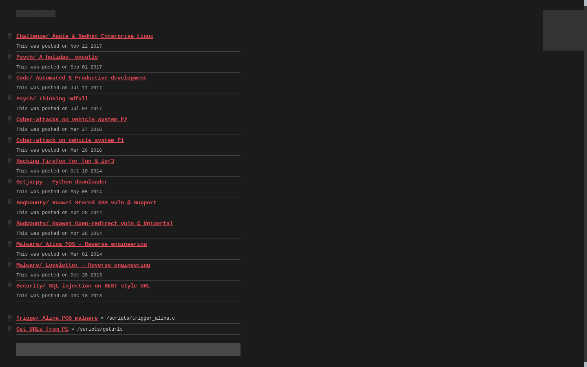
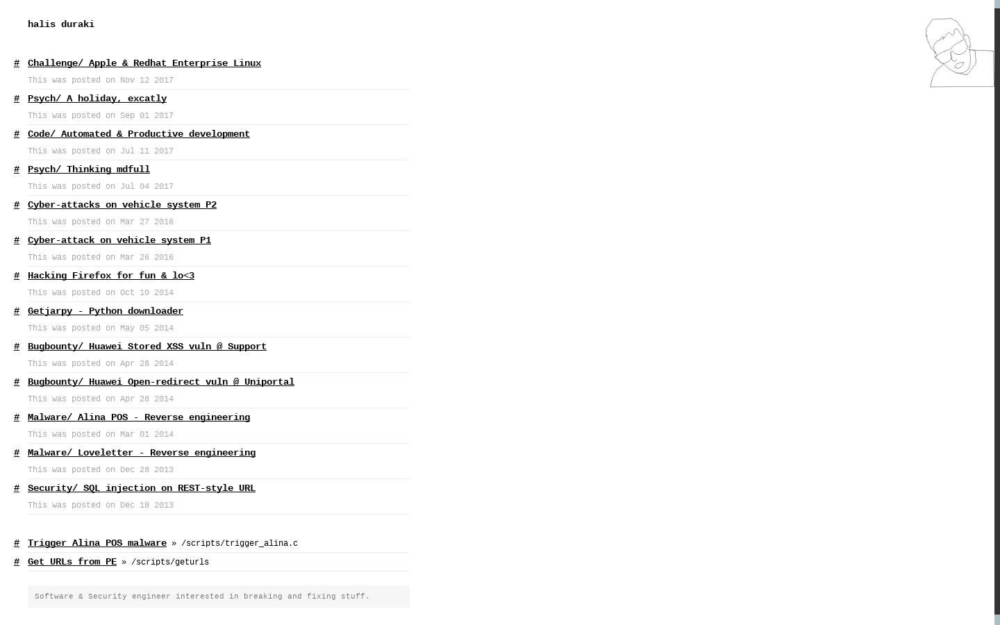

## sterdo

This is a theme that I wrote in regard to expression of self. I spent some time
studying about design and always loved to browse dA in old days. Time is
different now, I try to design from my point and sometimes good stuff comes out.
  
Following the pattern of [Mial] e.g.
[dotfiles](https://github.com/duraki/dotfiles) I've managed to recreate
environment my current workstation is used. Base case is dev & pwn.

* To use theme, you will probably need [art](https://github.com/duraki/duraki.github.io/blob/master/art), a static blog generator.

* [Demo](https://duraki.github.io)

* Preview:

`Copyright (c) Halis Duraki <duraki@linuxmail.org>`
